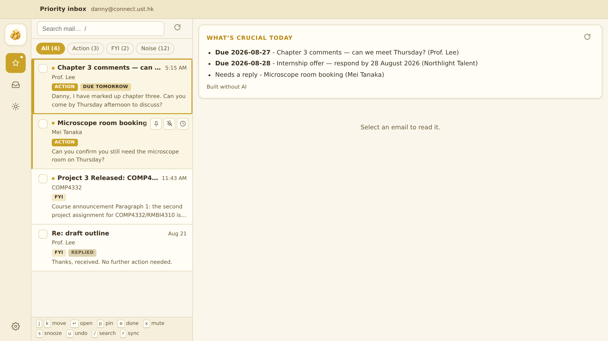

# Fools Gold — v1.0, Email Secretary

An agentic email secretary for Outlook that reads, ranks and summarises your
inbox. Local-first and **read-only**: your mail and your tokens never leave your
machine, and v1.0 has no code path that writes to your mailbox.



## What v1.0 does

- **Two mail sources**: Apple Mail's local store (no sign-in of any kind) or
  Microsoft Graph (OAuth authorization code + PKCE)
- **Local cache** of recent mail in SQLite — metadata and bodies
- **Triage** of every email into **Action needed / FYI / Reference-noise**, with
  deadline extraction
- **Priority ranking** driven by a list of what you're working on *right now*,
  not a static ranking of senders
- **A daily digest** — "what's crucial today" — generated once per day
- **The priority inbox is a checklist** — tick an email off and it strikes
  through, washes gold and slides away; mute one and it desaturates and shrinks
  out. Both are undoable and both re-rank the list instantly.
- **Keyboard-first list** — `j`/`k` move, `Enter` open, `p` pin, `e` done,
  `x` mute, `s` snooze, `u` undo, `/` search, `r` sync
- **Four themes**: Gold & Ivory (default), Dark, Green, Purple — including the
  plate behind the app icon, which is a themed CSS surface rather than part of
  the logo file


Calendar, replying and the live agent chat are 2.0 and 3.0. See
[docs/v1-design-spec.md](docs/v1-design-spec.md).

## How ranking actually works

Priority is contextual and time-varying, so the score is built from independent
signals rather than a sender allowlist.

**What the message is**

| Signal | Effect |
|---|---|
| Actionability bucket | action +45, fyi +15, noise 0 (capped at 20) |
| Deadline proximity | due today +30 · ≤2 days +22 · ≤7 days +12 |
| Deadline **staleness** | 1–2 days overdue +24 · ≤1 week +13 · ≤3 weeks +5 · **beyond that 0** |
| Your active priorities | ±weight per matched topic, capped at +30 |
| Structural facts | To: you +10 · Cc: only +2 · high importance +8 · unread +4 · attachment +3 · recency up to +8 |

**What you actually did** — behaviour beats inference, so these outweigh the text

| Signal | Effect |
|---|---|
| You replied to it | **−30** — whatever it asked for, you did it |
| You starred it | **+22** |
| From someone you write back to | up to **+12**, learned from your Sent mailbox |
| Read weeks ago, never starred, never answered | **−12 to −18** |

**What you told it** — explicit verdicts from the list, and these dominate

| Action | Effect |
|---|---|
| Pin | sorts to the top as its own group (+60 orders items within it) |
| Not important | −45 |
| Tick the checkbox (done) | −60, and it leaves the priority view |
| Snooze | hidden until the timer expires |

Every email shows a **"why this ranking"** line, so the list is never a black box.
Changing your priorities or acting on a row re-scores everything **with no AI
calls at all**.

The structural half runs with **no AI**. If the model is off, rate-limited or
offline, the list still sorts sensibly and the app says so.

> **Why staleness matters.** Overdue deadlines used to score a flat +26 forever
> while the best recency bonus was +8, so a print notice whose collection window
> closed three months ago permanently outranked this morning's mail. Decay is
> what keeps a priority inbox from silently turning back into an ordinary one.

## Architecture

```
electron/          desktop window (1120×760), owns the backend's lifetime
frontend/          React + Vite SPA — icon rail, list pane, detail pane
backend/app/
  sources/         where mail comes from, behind one interface
    applemail.py     reads ~/Library/Mail/**/*.emlx — no auth at all
    graph_source.py  Microsoft Graph
  graph/           Microsoft Graph OAuth + read-only mail sync
  llm/             provider adapters behind one interface
  priority.py      scoring, structural classification, topic suggestions
  pipeline.py      classify → score → digest, with fallbacks at every step
  db.py            SQLite schema and access
```

State lives in `~/.foolsgold/` — `foolsgold.db` plus `secret.key` (0600), the
Fernet key that encrypts OAuth tokens and API keys at rest. Delete that folder
to reset everything.

## Mail sources

Both implement one `MailSource` interface, so classification, scoring, the
digest and the UI never learn where a message came from.

**Apple Mail (default).** Reads the `.emlx` files Apple Mail has already
downloaded to `~/Library/Mail`. No app registration, no OAuth, no API quota, no
network — and no way for a university IT policy to block it. Needs macOS **Full
Disk Access**, since `~/Library/Mail` is TCC-protected. See
**[docs/APPLE_MAIL_SETUP.md](docs/APPLE_MAIL_SETUP.md)**.

> This is the recommended path if <https://entra.microsoft.com> tells you you
> have no access — many universities block students from registering apps, and
> that is not something the app can work around.

**Outlook via Microsoft Graph.** Live, always current, but needs an Entra app
registration you create under your own Microsoft account. See
**[docs/ENTRA_SETUP.md](docs/ENTRA_SETUP.md)**.

Switching is a dropdown in Settings. Priorities and classifications are keyed to
the mail itself, so they survive the switch.

## AI providers

Adapters share one interface (`classify_batch`, `summarize`), so switching is a
dropdown, not a rewrite.

- **GitHub Copilot (default)** — signs in with GitHub's OAuth device flow, so
  there is no API key to paste and the token lives in your keychain rather than
  in this app. Works with Copilot Free, Pro and student Pro.
- **Anthropic (Claude)** / **OpenAI** — per-token API key, entered in Settings.
- **None** — structural signals only. A legitimate way to run the app.

> **Why Copilot and not the old free GitHub inference API:** GitHub Models was
> fully retired on 30 July 2026 — playground, catalog, inference API and BYOK,
> for all customers. The [Copilot SDK](https://github.blog/changelog/2026-06-02-copilot-sdk-is-now-generally-available/)
> (GA 2 June 2026) is the supported route for a Copilot subscriber.

**Two things worth knowing about the Copilot path.** It bills in *premium
requests*, not tokens — so Fools Gold batches ~10 emails per request and caches
every classification, keeping a full inbox to a handful of requests a day. And
Copilot is positioned as a coding assistant, so routing personal mail through it
means that text goes to GitHub/Microsoft under terms not written with
correspondence in mind. If that matters for your inbox, switch the provider or
run with **None**.

## Setup

**Python 3.11 or newer is required.** macOS ships 3.9 as `/usr/bin/python3`,
which is too old — the Copilot SDK needs 3.11, and FastAPI evaluates the route
type hints at runtime, which needs 3.10+. `setup.sh` checks this before it
builds anything and tells you what to install.

```bash
brew install python@3.13    # if `python3 --version` is below 3.11
./scripts/setup.sh          # Python venv + npm install
```

`setup.sh` finds the newest suitable interpreter itself. To force one:

```bash
FOOLSGOLD_PYTHON=/opt/homebrew/bin/python3.13 ./scripts/setup.sh
```

```bash
npm start                   # builds the UI and opens the app window
```

Then pick a source on the first screen:

- **Apple Mail** — add your account to Apple Mail, grant Full Disk Access, type
  your address. **[docs/APPLE_MAIL_SETUP.md](docs/APPLE_MAIL_SETUP.md)**
  Run `python3 scripts/check-mail.py` first to see exactly what is readable on
  disk — it separates "Mail hasn't synced yet" from "macOS is blocking access",
  which otherwise look identical.
- **Outlook** — create an Entra app registration first (~10 minutes, once),
  paste the client ID, sign in. **[docs/ENTRA_SETUP.md](docs/ENTRA_SETUP.md)**

### Development

```bash
npm run dev:ui              # Vite dev server on :5173, in one terminal
npm run dev                 # Electron pointed at it, in another
```

### Tests

```bash
cd backend && .venv/bin/python -m pytest
```

Scoped where it earns its keep: priority scoring, LLM-response parsing, and the
`.emlx` reader — the places that misbehave silently. The Apple Mail tests run
against a synthetic mail store, so they need no real mailbox. OAuth and the
dashboard flow are verified by hand.

## Requirements

macOS with **Python 3.11+** and Node 18+. Python dependencies are split into
`backend/requirements.txt` (core, required) and `backend/requirements-ai.txt`
(the Copilot SDK, optional — the app runs fine without it).

For mail, **either** Apple Mail with your account added (nothing else needed),
**or** a Microsoft account you can create an Entra app registration under.

A GitHub Copilot subscription (Free tier included) if you want the AI features.
The app runs without one.
